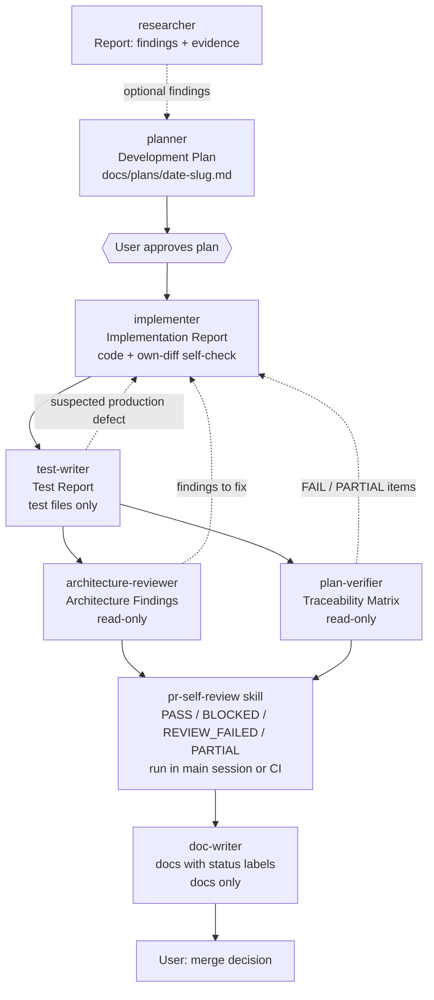

# Development Plan: four new subagents (`test-writer`, `architecture-reviewer`, `plan-verifier`, `doc-writer`) + update `.claude/agents/README.md`

**Date:** 2026-09-28
**Modules affected:** repository config/docs only: `.claude/agents/` (4 new files + `README.md`), optionally root `AGENTS.md` (1 link line), and optionally `.claude/settings.json` + `.claude/hooks/` (Phase 2, hardening). The `server/`, `client/`, `reviewer-core/`, `e2e/` modules and application code are NOT changed (they are only read as a source of rules and as verification targets).
**Status:** waiting on the user's approval (answers to the "Open questions" below). No agents have been created yet; this file is only a plan.

**INSIGHTS.md entries considered:**
- `INSIGHTS.md` (root), 2026-09-21 Session Notes — the list-page read-only preview and the detail-page action cards must stay separate (`client/specs/pages.md:5`): `doc-writer` must not merge these surfaces in documentation, and `test-writer` must test them separately.
- `client/INSIGHTS.md`, 2026-09-21 Recurring Errors & Fixes — after a review completes, the `pulls` query must be invalidated (`client/src/lib/hooks/reviews.ts:143`): an example of boundary behavior that `test-writer` must cover and `plan-verifier` must check as a separate matrix row.
- `client/INSIGHTS.md`, 2026-09-27 Recurring Errors & Fixes — `linked` ≠ `enabled`; the test must check both the visual state and the persisted state after reload (`SkillsTab.tsx:18-21`): a model example of "test behavior, not implementation" for `test-writer`.
- `server/INSIGHTS.md`, 2026-09-27 Database integrity / Boundary validation — transactional updates and duplicate rejection at the API boundary: exactly the cases that require `*.it.test.ts` against real Postgres, not a mocked DB.
- `server/INSIGHTS.md`, 2026-09-21/23 Codebase Patterns/Correctness — PR-list counters only take the most recent review per agent; `plan-verifier`/`architecture-reviewer` must know the invariant "never call reviewer-core/LLM while rendering the list" (this is also rule 10 in `onion-architecture/SKILL.md`).
- `reviewer-core/INSIGHTS.md`, `e2e/INSIGHTS.md` — grounding is deterministic after the LLM step; e2e uses only deterministic locators against the seeded `acme/payments-api`.
- Observation (not an INSIGHTS entry): `client/AGENTS.md` references a "Tool & Library Notes" section in `client/INSIGHTS.md` that does not exist in that file (it has 5+ entries of other categories) — `test-writer` must not look for that section, only read the top-3 relevant entries.

**Architectural constraints** (each traceable to a file actually read):
- Format and conventions of the existing agents: frontmatter `name/description/tools/model[/skills]`, sections "Hard constraints", "Required workflow", the report format, "Style: Write in English" — `.claude/agents/{researcher,planner,implementer}.md`. The new agents' files are written in English (like the existing ones); this plan document is in English per the caller's request.
- The agents index is an index, not a copy of the rules (`.claude/agents/README.md`, first paragraph): in the README we add rows/tables, not duplicate prompt text.
- The README currently says "review agents (not in this roster yet)" and "`Bash` … is a prompt-level convention" — both need to be corrected (see "Exact README edits").
- Skills: preloaded as full text (`skills:`), missing skills are silently skipped (research) — names must match `.claude/skills/*` directories exactly (present: `drizzle-orm-patterns, engineering-insights, fastify-best-practices, mermaid-diagram, next-best-practices, onion-architecture, postgresql-table-design, pr-self-review, react-best-practices, react-testing-library, security, typescript-expert, ui-frontend-architecture, zod`).
- Root `AGENTS.md` "Key Rules": "No barrel exports in modules", "`Testing`: `*.it.test.ts` = integration (Postgres); others = unit (hermetic)", "`server/src/vendor/shared` is canonical; `client/src/vendor/shared` must remain a symlink", "drizzle migrations are gated by migration journal", "Never auto-migrate on boot".
- Root `AGENTS.md` "Do Not Touch": `.github/workflows/`, `turbo.json`, `docker-compose.yml`, `server/src/db/migrations/` (add only), lock files. Additionally `TESTING.md`: `server/package.json` is `skip-worktree` → no new agent edits it (tests run via `pnpm exec vitest run …`).
- Root `AGENTS.md` "Session Protocol": read the relevant module `INSIGHTS.md` before working and state the top-3 entries (applies to `test-writer`, `doc-writer`; for review agents — as part of Context).
- `server/AGENTS.md` Key Rules: "tests must cover cross-workspace access as 403", Zod validation → `422`, `pnpm architecture:check` (dependency-cruiser, `server/.dependency-cruiser.js`) before a backend PR.
- `.claude/skills/pr-self-review/SKILL.md`: a diff-aware review with `PASS/BLOCKED/REVIEW_FAILED/PARTIAL` already exists, with severity/confidence from `references/finding-policy.md`. The new agents must not duplicate it and must not issue a merge verdict.

## Objective
Expand the roster from three agents (researcher → planner → implementer) into a full cycle: writing tests (`test-writer`), independently checking architectural boundaries (`architecture-reviewer`), tracing finished code against every plan item (`plan-verifier`), and documenting what was built (`doc-writer`). The core principle, already established in `implementer.md` and the README: the generator and the verifier are different agents; review agents have no write rights, and permission boundaries are explicitly split into "enforced" (tools allowlist, optionally a hook) and "prompt-level" (a convention stated in the prompt text). The output of this plan is 4 agent files, an updated README, and a dry-run-verified roster that behaves according to spec.

---

## Pipeline (placement in the pipeline)

Subagents do not see conversation history (docs) and — by my assumption (inference, verify via `/agents`) — cannot spawn other subagents (none of them are given `Task`/`Agent`). So orchestration happens in the main session/by the user; handoff between steps is an explicit input (a path to the plan, a git range, a path to a report).



Placement rules:
- `test-writer` runs after `implementer` (plans already contain "Testing strategy → New tests needed"); it is also allowed before implementation (TDD red tests) when the caller explicitly says so.
- `architecture-reviewer` and `plan-verifier` are independent and can run in parallel; both read the same git range. `plan-verifier` does NOT perform architecture/security review; `architecture-reviewer` does NOT check against the plan.
- `pr-self-review` remains the sole source of the `PASS/BLOCKED` status (SKILL.md "Blocking rule"); the new agents only set a per-finding `blocking_candidate` (see schema) or a plan status — never a merge status. A security review as a separate agent stays out of the roster (recorded in the README as "not in roster").
- `doc-writer` runs last: it documents what has been verified (the `plan-verifier` matrix already gives a ready "shipped/planned" split).
- Feedback loops (dotted) mean the user re-invoking `implementer`; agents do not call each other directly.

---

## Steps

Order and dependencies: 0 → 1 → (2, 3, 4, 5 independent, can run in parallel) → 6 (depends on the finalized name/tools/skills from 2–5) → 7 (optional) → 8 → 9 (requires a session restart) → 10 (optional, only based on 9's results) → 11.

0. [process] Get the user's decisions on the "Open questions" (below), specifically: the model for review agents, whether to introduce hooks-hardening, whether `test-writer` may append to `INSIGHTS.md`, whether to touch the root `AGENTS.md`.
   - Files/areas: — (no files)
   - Skills implementer should apply: `engineering-insights` — do not create entries without passing the quality gate (Not obvious / Actionable / Not duplicate).

1. [config] Pre-check facts before writing (read-only): (a) the skill names in the preload lists exist as `.claude/skills/<name>/SKILL.md`; (b) there is no `.claude/settings.json` (only an untracked `settings.local.json` exists) — accounted for in step 10; (c) which Claude Code version is in use and whether it supports `hooks:` frontmatter for subagents (not confirmed by research → verify in the `/agents` docs before use); (d) whether `.claude/agents/README.md` (no frontmatter, untracked) breaks agent loading — an existing condition, just record it.
   - Files/areas: `.claude/skills/*/SKILL.md`, `.claude/agents/`
   - Skills implementer should apply: `typescript-expert` — not applicable to Markdown; only the "never invent facts" rule from `implementer.md` applies here.

2. [config] Create `.claude/agents/test-writer.md` per the spec below.
   - Files/areas: `.claude/agents/test-writer.md`
   - Skills implementer should apply: n/a (no code) — but the file's style mirrors `planner.md`/`implementer.md`.

3. [config] Create `.claude/agents/architecture-reviewer.md`.
   - Files/areas: `.claude/agents/architecture-reviewer.md`

4. [config] Create `.claude/agents/plan-verifier.md`.
   - Files/areas: `.claude/agents/plan-verifier.md`

5. [config] Create `.claude/agents/doc-writer.md`; the docs routing table lives HERE (single source), the README only links to it.
   - Files/areas: `.claude/agents/doc-writer.md`. The new folders `docs/features/`, `docs/how-to/`, `docs/decisions/`, and the file `docs/README.md` are NOT created as part of this plan — only on demand for a concrete doc task.

6. [docs] Update `.claude/agents/README.md` (exact edits below).
   - Files/areas: `.claude/agents/README.md`

7. [docs, optional, requires separate approval] Add one line to the root `AGENTS.md` → "Links & References": `- [Custom subagents](.claude/agents/README.md) — roster, tools, pipeline`. `AGENTS.md` currently doesn't mention agents; but `AGENTS.md` is the "project contract", so changing it requires explicit permission. If not approved — skip (nothing breaks).
   - Files/areas: `AGENTS.md`

8. [verify] Static check of the files (commands below).
9. [verify] Reload the agent registry and run dry-runs (see "Verification").
10. [hardening, optional] Hooks for enforced restriction (see "Enforced vs prompt-level"), only after 9 and with approval.
11. [insights] If a dry-run surfaces something non-obvious, recurring and actionable (e.g. "an agent with Bash still wrote a file"), add an entry to `ENGINEERING-INSIGHTS.md` via `engineering-insights` (append-only, subject to the quality gate).

---

## Agent specifications

Common to all four: file language — English; sections — `Hard constraints`, `Required workflow`, `Input`, `Output format`, `Style`; every fact/rule in the output must come from a file the agent actually read (as in `planner.md`); if the request is unclear — 2–4 clarifying questions (as in `researcher.md` Step 0); no `Task`/subagent spawning; `WebSearch/WebFetch` given to none of them (all information lives in the repo).

### Common table

| | `test-writer` | `architecture-reviewer` | `plan-verifier` | `doc-writer` |
|---|---|---|---|---|
| tools | `Read, Grep, Glob, Bash, Write, Edit` | `Read, Grep, Glob, Bash` | `Read, Grep, Glob, Bash` | `Read, Grep, Glob, Bash, Write, Edit` |
| model | `sonnet` | `sonnet` (see Open question 1) | `sonnet` (see Open question 1) | `sonnet` |
| skills preload | `react-testing-library`, `fastify-best-practices`, `zod`, `drizzle-orm-patterns` (~943 lines) | `onion-architecture`, `ui-frontend-architecture` (~240) | none (0) | `mermaid-diagram` (~280) |
| Writes files | test paths only (allowlist) | no | no | documentation paths only (allowlist) |

Preload cost estimate (proxy — line count of `SKILL.md`; tokens are roughly proportional, this is inference): `planner`/`implementer` load 12 skills = 2720 lines (`drizzle 138 + engineering-insights 308 + fastify 75 + next 153 + onion 90 + postgres 202 + react-best 175 + RTL 603 + security 268 + typescript-expert 431 + zod 127 + ui-arch 150`). The new agents are deliberately lighter: preload only what's needed on EVERY invocation; the rest (`typescript-expert` 431, `security` 268, `next-best-practices` 153, `postgresql-table-design` 202, `engineering-insights` 308, `pr-self-review`) is read on demand via `Read` — the same "on demand" principle the README already describes for `mermaid-diagram`/`pr-self-review`. If a dry-run shows an agent systematically missing a rule from a non-preloaded skill, move that skill into preload (a data-driven decision).

### 1. `test-writer`

**Frontmatter (verbatim):**
```yaml
---
name: test-writer
description: Writes and runs tests for a given feature, diff, or plan's "Testing strategy": client components (Vitest + React Testing Library) and server routes/services (Fastify inject; unit vs *.it.test.ts with real Postgres). Edits test files only, never production code. Use proactively after implementation.
tools: Read, Grep, Glob, Bash, Write, Edit
model: sonnet
skills:
  - react-testing-library    # ui tests
  - fastify-best-practices   # backend inject testing
  - zod                      # contract/validation assertions
  - drizzle-orm-patterns     # integration-test data setup
---
```
Tools rationale: `Write` (new tests) + `Edit` (edits to existing tests) + `Bash` (running `vitest`/`typecheck`). No `Task`, no web. Skills rationale: RTL (603) — for UI tests, the only skill with testing rules (query priority, userEvent, async); `fastify-best-practices` (75, short) — covers the `inject` section; `zod` (127) — 422/schema assertions; `drizzle-orm-patterns` (138) — setup/seeds/transactions in `.it.test.ts`. Deliberately NOT preloaded: `typescript-expert` (431, read on demand for complex types in tests), `security` (the cross-workspace 403 requirement comes from `server/AGENTS.md`, not from a skill), `next-best-practices`, `postgresql-table-design`, `onion-architecture` (tests must not change layers).

**Hard constraints:**
- Do NOT edit production code: everything outside the test-path allowlist is forbidden: `client/src/**/*.test.{ts,tsx}`, `client/src/test/**`, `server/test/**` (including `server/test/helpers/**`), `reviewer-core/test/**`, `e2e/specs/*.flow.json` (only if the task explicitly concerns e2e). Even "helper" changes are forbidden: `server/src/adapters/mocks.ts` (it's under `src/`, the prod tree), `vitest.config.ts`, `package.json`, lock files, `server/src/db/migrations/`, `*/vendor/shared`, `.github/workflows/`, `INSIGHTS.md` (see Open question 3), `AGENTS.md`. If a test cannot be written without changing prod code/a mock/config — stop and report, don't work around it.
- NEVER change production code to make a test pass, and never weaken or remove an assertion to make it green; don't add `.skip`/`.only`/`it.fails`/`retry` without the caller's explicit permission. A test that fails because of a likely bug in the code is left as-is, and reported as `SUSPECTED_PRODUCTION_DEFECT` with evidence (this is the plan's own design, not sourced).
- Bash — only: `pnpm test`, `pnpm exec vitest run <path|--exclude '**/*.it.test.ts'|.it.test>`, `pnpm typecheck`, `npm test` (reviewer-core), read-only git (`status/diff/log`), `ls/cat/rg/find`. No `git add/commit/push/restore/reset/clean`, no `rm`, no `sed -i`/redirects into non-test files, no installs or network access. Prompt-level (see the enforcement table).
- Tests per `TESTING.md`: "typological, not exhaustive" — behavior at the boundaries, one happy path plus one edge case that genuinely matters; mock the outside world (`server/src/adapters/mocks.ts`: `MockLLMProvider`, `MockGitClient`…), use real Postgres for data-backed workflows, not a mocked DB.
- `*.it.test.ts` = any test that imports `test/helpers/pg.ts` (`startPg`, `dockerAvailable`); gate with `const d = hasDocker ? describe : describe.skip` as in `server/test/agents-versions.it.test.ts`. A skipped test ≠ a passing one: report it separately as "SKIPPED (no Docker)".
- For new server routes it's mandatory to cover: the cross-workspace → 403 case and the invalid-input → 422 case (`server/AGENTS.md` Key Rules), if the route is in scope.
- UI: RTL query priority (`getByRole` → `getByLabelText` → … → `getByTestId` last, https://testing-library.com/docs/queries/about/#priority), `userEvent` rather than `fireEvent`, mock only `fetch`/the network, not your own components/hooks; don't test implementation details (Kent C. Dodds). Where `client/AGENTS.md` (the `getByText` example) and the skill disagree — the skill's query priority wins; where the skill's generic setup (`src/test/setup.js`, msw, Vite) disagrees with the repo (`client/src/test/setup.ts`, `vitest.config.ts`, `fetch` mocked) — the repo wins.
- Non-flaky: no `setTimeout` sleeps; use `findBy*`/`waitFor`; fake timers; isolate state between tests; run new tests at least twice (own design).
- Size: "fewer, longer tests" per the skill; every new test needs a one-line justification of "what would break if the behavior regressed" in the report.

**Required workflow:**
1. Read root `AGENTS.md`, `TESTING.md`, the `AGENTS.md` of the modules in scope (`client/`, `server/`, `reviewer-core/`, `e2e/`), and state the top-3 entries from the relevant `INSIGHTS.md` files.
2. Accept input: (a) a plan (`docs/plans/…md` → "Testing strategy" section) or (b) a diff/paths + a description of the desired behavior. If it's unclear what behavior to test — ask 2–4 clarifying questions.
3. Classify the target and file location: client component → a colocated `*.test.tsx` next to it (like `…/FindingCard/FindingCard.test.tsx`); server unit → `server/test/<kebab>.test.ts` via `buildApp` + `app.inject` (https://fastify.dev/docs/latest/Guides/Testing/), mocks from `src/adapters/mocks.ts`; server integration → `server/test/<kebab>.it.test.ts` with `startPg` (Testcontainers Postgres); reviewer-core → `reviewer-core/test/`; e2e → only `*.flow.json` with `--url/--text/find`, never `chat`, no Playwright (`e2e/AGENTS.md`).
4. Find existing tests and helpers nearby (`Glob/Grep`), reuse setup; don't duplicate existing coverage.
5. Write/change test files only.
6. Run the matching command: client `cd client && pnpm test`; server unit `cd server && pnpm exec vitest run --exclude '**/*.it.test.ts'`; integration `cd server && pnpm exec vitest run .it.test` (needs Docker); `pnpm typecheck` for the affected package. e2e without a running stack → NOT RUN.
7. Self-check: `git status --porcelain` — every changed path is in the allowlist ("Non-test files changed: none").
8. Return the Test Report.

**Input:** a plan/path to a plan, or a git range, or a list of files + a description of the behavior; optional: "TDD (before implementation)".

**Output — Test Report:**
```
# Test Report: <feature / plan ref>
**Scope:** <modules, files/behaviors under test>
**Skills applied / not applicable:** <skill — where>
## Tests written or changed
| File | Kind (client / server-unit / server-it / core / e2e) | Behavior covered | Would fail if… |
## Commands run and results
| Command | Result (pass/fail/skipped) | Notes |   # skipped and NOT RUN reported separately
## Suspected production defects
- <test> — expected vs actual — evidence file:line — (test left as-is)   | or "none"
## Coverage gaps / not tested (and why)
## Guard check
- Non-test files changed: none | <list>
## Suggested INSIGHTS entries (not written)
```

### 2. `architecture-reviewer`

**Frontmatter:**
```yaml
---
name: architecture-reviewer
description: Read-only architecture review of a diff or given paths: onion/UI layering, no barrel exports, vendor/shared symlink, append-only migrations. Returns findings with severity, file:line, quoted code and rule source. Use proactively after implementation, before a PR.
tools: Read, Grep, Glob, Bash
model: sonnet
skills:
  - onion-architecture       # backend layering rules + forbidden patterns
  - ui-frontend-architecture # client feature boundaries
---
```
Preload rationale: both skills are exactly the subject of the work (90 + 150 lines, cheap). The rest (`zod`, `security`, `next-best-practices`) is out of scope; security/contract is reviewed by `pr-self-review`.

**Read-only mechanism (decision):** `tools` without `Write/Edit` (enforced at the tool level). Bash stays, because it's needed for `git diff <range>`, `rg`, `readlink`/`test -L`, `pnpm architecture:check` (dependency-cruiser gives deterministic evidence: rule name + from→to). But Bash can still write (`>`, `tee`, `sed -i`), and `disallowedTools` with a `Bash(...)` specifier — per research — removes the whole Bash tool, so Bash cannot be narrowed natively. Therefore: Phase 1 = allowlist without Write/Edit + a prompt-level restriction on Bash (the same approach as `researcher.md`, and the README honestly calls it that); Phase 2 (optional) = a PreToolUse hook on Bash with a command allowlist for `agent_type == architecture-reviewer` (exit 2 blocks). Do not set `permissionMode` (don't rely on permission prompts: bypass/acceptEdits/auto modes are inherited from the parent — research). The "no Bash at all" alternative was rejected: it loses `git diff` and `architecture:check`, i.e. the determinism of the evidence.

**Hard constraints:**
- Do not create/edit/delete files; working around this via the shell (`>`, `tee`, `sed -i`, `git add/commit/restore/checkout`, `rm`, `mv`, installs, network) is forbidden. Allowed Bash: `git diff/log/show/blame/status`, `ls/cat/head/tail/wc/rg/find` (no `-exec/-delete`), `test -L`, `readlink`, `pnpm architecture:check`, `pnpm typecheck`.
- Every finding must have all schema fields (rule_source, file:line, a verbatim code quote). No quote from a file the agent actually opened — no finding. Never invent a rule: the rule must literally exist in `AGENTS.md`/`SKILL.md`/`.dependency-cruiser.js`.
- Do not issue a `PASS/BLOCKED` merge status and do not review security/contract issues outside architecture — that's `pr-self-review`; here only a `blocking_candidate` per `finding-policy.md`.
- Speculative/subjective remarks get `low`/`confidence: low`, never `critical` (`finding-policy.md`: "Never promote a subjective preference… to critical").
- Scope: a git range (as in `pr-self-review`: working tree or merge-base..HEAD) or explicit paths; never silently expand to the whole repository. Findings outside the diff are `scope: preexisting` and never block.
- Coverage honesty: list the rules checked, the ones skipped (with a reason), and the files with no coverage (`uncovered`).

**Rule catalog (what the agent derives findings from, all sources read):**
- `onion-architecture/SKILL.md` "Non-negotiable dependency direction" + "Forbidden patterns": route files importing `drizzle-orm`/`src/db/schema`; `domain/`/`application/` importing Fastify/Drizzle/an SDK/`Container`; the full `Container` inside application; a repository that returns HTTP DTOs; a feature-only "shared" utility; barrel exports; duplicated provider logic. Module shape (`domain/`, `application/{dto,ports,use-cases}`, `adapters/{inbound/http,outbound/persistence,outbound/providers}`, `index.ts` with no business logic). Rule 10 (PR list: no reviewer-core/LLM calls while rendering).
- `pnpm architecture:check` (`server/.dependency-cruiser.js`): quote the violated rule's name from the output.
- `ui-frontend-architecture/SKILL.md` + `client/AGENTS.md` Key Rules: `page.tsx` are thin RSC entry points, `'use client'` used narrowly; API data goes through TanStack Query in `src/features/*/api/hooks.ts` with keys from `src/shared/api/query-keys.ts` (`src/lib/hooks/*` is a compat layer); code ownership (no global dumping-ground `components/hooks/utils`).
- Root `AGENTS.md`: no barrel exports (search for `export * from`, `export { … } from`, and an `index.ts` that consists only of re-exports; note that a server module's `index.ts` is legitimate as wiring — this distinction is my own conclusion/inference, confirm during dry-run); `client/src/vendor/shared` stays a symlink to `../../../server/src/vendor/shared` (`test -L` + `readlink`; the diff must not add ordinary files under this path); `server/src/db/migrations/` — append-only (`git diff --name-status`: any `M/D/R` on existing migrations and any non-append change to the journal is a finding; the journal's exact path, likely `meta/_journal.json`, must be confirmed by reading the folder); no auto-migrate on boot; lock files untouched; Do Not Touch paths unchanged.

**Required workflow:** 1) read root `AGENTS.md` + the `AGENTS.md`/`INSIGHTS.md` of the affected modules; 2) determine the range; `git diff --name-status`, classify the files (server/client/core/e2e/shared/db); 3) run `pnpm architecture:check` (server) if `server/src` is affected; 4) for each applicable rule, run a deterministic search (`rg`) and read the surrounding context; 5) filter out false positives (read the file, don't rely on grep alone); 6) assemble findings using the schema; 7) report.

**Finding schema** (modeled on ArchUnit: rule + from→to + location; the rule/severity/from/to fields follow dependency-cruiser; the severity/confidence vocabulary is the same one used in `finding-policy.md`, to avoid a second one):
```
- id: ARCH-001
  rule_id: onion/no-drizzle-in-routes          # stable slug; or the dependency-cruiser rule's name
  rule_source: .claude/skills/onion-architecture/SKILL.md#Forbidden patterns — "route files importing `drizzle-orm` or `src/db/schema`"
  severity: critical | high | medium | low     # per finding-policy.md
  confidence: high | medium | low
  scope: diff | preexisting
  from: server/src/modules/x/adapters/inbound/http/routes.ts:12
  to: drizzle-orm                              # the module/layer being depended on
  evidence: |
    import { eq } from 'drizzle-orm'           # verbatim, <=5 lines
  detection: dependency-cruiser rule <name> | rg '<pattern>' | manual read
  impact: <1 sentence, no generic advice>
  remediation_direction: <where it should move, no code>
  blocking_candidate: yes | no                 # yes only for high-confidence critical/high per finding-policy; default no
```
Severity of architectural violations: typically `medium`/`high`; `critical` only when the `finding-policy.md` definition is triggered (e.g. a rewritten past migration = an unsafe migration) — this is my own conclusion (inference).

**Output — Architecture Review:** a header (range, files by category), `Rules checked` (list + result), `Findings` (by severity, in the schema), `Rules skipped / uncovered files`, `Commands run`, `Limitations`. No merge status; final line: `Findings: N (blocking_candidate: M) — merge status is decided by pr-self-review`.

**Relationship to `pr-self-review`:** it is broader (security, contract, DB safety, tests, mergeability, routing to skills, suppressions) and decides the status; `architecture-reviewer` is narrower but goes deeper on layer boundaries and structural invariants, always with evidence; its findings can be fed into `pr-self-review` as an input/corroboration (deduped by file+line+root cause, per `finding-policy.md`). Duplication is avoided: security/authz/injection/migration-safety-in-substance/tests are never covered here.

### 3. `plan-verifier`

**Frontmatter:**
```yaml
---
name: plan-verifier
description: Read-only verifier: checks finished code item by item against a Development Plan (docs/plans/*.md) and the stated requirements, returning a traceability matrix (PASS/FAIL/PARTIAL/NOT-VERIFIED) with file:line evidence. Use after implementation.
tools: Read, Grep, Glob, Bash
model: sonnet
---
```
No `skills:`: it checks conformance to the plan, and skill rules only matter when the plan explicitly cites them; the agent reads them on the spot (`Read` on the relevant `SKILL.md`), so preloading 2720 lines isn't justified. Read-only mechanism — same as `architecture-reviewer` (allowlist without Write/Edit; Bash stays for `git diff/log`, `rg`, `ls`, and — only if the caller asked to "run verification" — the commands from the plan's "Commands to run" section, e.g. `pnpm typecheck`, `pnpm architecture:check`, a targeted `pnpm exec vitest run <file>`). By default it does NOT run tests: results from the Implementation Report are "claimed", not "verified" → the corresponding matrix rows read `NOT-VERIFIED (claimed by implementer, not re-run)` (own design; reduces the risk of "verification by faith").

**Hard constraints:** changes no files (like `researcher.md`, shell workarounds forbidden); does not substitute generic advice for the check — every matrix row must have a concrete verification act and evidence; no "looks good" verdicts; does not trust the Implementation Report as proof (only as a list of claims to verify); does not assess architecture/security (`architecture-reviewer`/`pr-self-review`); does not invent plan items — if the plan is ambiguous or unparseable, it stops and asks (2–4 questions); no guessing "probably done".

**What counts as an "item" (breaking down the plan, format follows `planner.md`'s "Development Plan format"):** Objective → R0 (1 line); every numbered Step → `S<n>`, with its sub-points → `S<n>.F` (Files/areas actually changed/existing), `S<n>.K` (every skill rule from "Skills implementer should apply"); every "Architectural constraints" bullet → `C<n>`; every "Skill roster" row → checked via the matching `S<n>.K`; "Testing strategy" → `T<n>` (presence of each new test, correct type unit vs `*.it.test.ts`, commands); "Explicit non-goals" → `N<n>` (a negative check: no changes to those areas in the diff); "Risks / open questions" → `Q<n>` (whether closed/addressed); additional requirements from the caller → `R<n>`. Bidirectional traceability (Wikipedia Requirements traceability): forward (item → code/test) and backward (changed file → item); empty cells = gaps.

**Status rules (own vocabulary; not from sources):**
- `PASS` — evidence (file:line + quote, or a verification result the agent ran itself) fully satisfies the item.
- `FAIL` — the evidence contradicts the item, or the artifact being checked is missing.
- `PARTIAL` — part of the conditions is met: must list `met:` / `unmet:`.
- `NOT-VERIFIED` — cannot be checked in this environment (needs a runtime/Docker/UI, a test wasn't run, no access) — with a reason and "what would confirm it"; NEVER counted as PASS.
- Guard against LLM-judge bias (LLM-as-a-Judge): a fixed rubric as above; mandatory verbatim evidence instead of a "general impression" score; verifier ≠ generator (a separate agent); the verdict is computed mechanically, not "by eye". Limitation: the same model family may exhibit self-preference — hence Open question 1.

**Required workflow:** 1) accept a plan (a path under `docs/plans/` or its content) + a range/paths; if there is no plan — stop; 2) read the plan in full, break it down into items (only enumerate IDs at this stage, no evaluation yet); 3) collect the diff (`git diff --name-status <range>`) and context; 4) for every item, run the check and record a row; 5) reverse traceability: changed files with no matching item → `Unplanned changes` (scope creep, with file:line), separately check `Explicit non-goals`/Do Not Touch; 6) sanity check for completeness: `Items extracted = Rows in matrix`; 7) compute the plan status; 8) report.

**Output — Plan Verification Report:**
```
# Plan Verification: <plan path>
**Range:** <git range> · **Requirements supplied:** yes/no (if no: requirements coverage = NOT-VERIFIED)
**Items extracted:** N · **Rows in matrix:** N   # must match
## Traceability matrix
| ID | Plan item (verbatim, short) | Check performed | Status | Evidence (file:line + quote / command output) | Notes (met/unmet, why NOT-VERIFIED) |
## Reverse trace: Unplanned changes
| File | Change | Nearest plan item | Comment |
## Non-goals / Do Not Touch check
## Summary
PASS: a · FAIL: b · PARTIAL: c · NOT-VERIFIED: d
Plan status: PLAN_MET (all PASS) | PLAN_NOT_MET (>=1 FAIL) | PLAN_INCOMPLETE (no FAIL, but PARTIAL/NOT-VERIFIED remain)
## Could not verify (aggregated) and what would verify it
```
`Plan status` is not a merge verdict (that's `pr-self-review`'s job). Observations outside the matrix are allowed only in the `Unplanned changes` section — no generic advice.

### 4. `doc-writer`

**Frontmatter:**
```yaml
---
name: doc-writer
description: Writes documentation for implemented features from code, Development Plans and reports, with Mermaid diagrams, into the right docs/ section. Marks planned vs shipped and never invents behavior. Edits docs only, never code.
tools: Read, Grep, Glob, Bash, Write, Edit
model: sonnet
skills:
  - mermaid-diagram          # diagrams; validation and syntax pitfalls
---
```
Rationale: a single skill, needed on every invocation (280 lines); Diátaxis/docs-as-code rules are baked into the prompt itself (briefly) rather than into a skill. `Edit` is needed to update existing docs and add links in READMEs; Write/Edit enforcement is a prompt-level allowlist (+ an optional hook, Phase 2).

**Hard constraints:**
- Document only what exists: every behavioral claim needs `path:line` evidence from code the agent actually read; no invented endpoints, fields, flags, or behavior. If sources disagree (the plan says X, the code does Y) — write what's in the code, and flag the discrepancy in "Open questions" rather than smoothing it over.
- Every document/section gets a status: `Shipped` (verified in code), `Planned` (in the plan, no code found), `Partial` (with a list of what exists/what doesn't), `Unverified` (couldn't be checked). Header format (own convention, inference; not YAML front matter, so GitHub renders it with no surprises):
  `> **Status:** shipped | partial | planned · **Verified against:** \`<git rev-parse --short HEAD>\` on <YYYY-MM-DD> · **Sources:** plan \`docs/plans/…\`, code \`path:line\``.
  Planned content inside a shipped document goes only in a separate "Planned (not implemented)" block.
- Write/Edit only in: `docs/features|how-to|decisions/**` (new, on demand), `docs/README.md` (an index, created together with the first new section), `<module>/docs/**`; in the existing `<module>/README.md` and the root `README.md` — only adding/updating a link line or a table row (API map/UI route map) for a feature that has actually shipped. Forbidden: code, tests, `AGENTS.md`/`CLAUDE.md`, `INSIGHTS.md`/`ENGINEERING-INSIGHTS.md`, `.claude/**`, `docs/plans/**` (the plan record is immutable, read-only), `docs/agent-prompts/**` (this mirrors `agents.system_prompt` from the DB for the application's reviewer agents, not Claude Code subagent documentation), `<module>/specs/**` (behavior contracts) — unless the request explicitly names them; otherwise propose the edit in the report.
- Bash: read-only only (`git log/rev-parse/diff`, `ls`, `rg`, `cat`); a Mermaid validator (`mmdc`) only if already installed locally, no installs/network.
- Never insert secrets or `.env` values; never copy INSIGHTS entries as documentation.
- Do not create new docs sections "just in case": a new folder only when there's a concrete document to put in it (Diátaxis how-to-use: structure grows from content).
- Diagrams: follow the `mermaid-diagram` Decision Guide; avoid the reserved word `end` as an id/label, quote labels with special characters (https://mermaid.js.org/intro/syntax-reference.html); every diagram is captioned with what it shows and must match the code (nodes = real modules/files); if it couldn't be validated, mark it "not rendered/validated".

**Routing table** (lives in `doc-writer.md`; built from the current tree: `docs/agent-prompts/`, `docs/plans/` (empty), `server/docs/architecture.md`, `server/specs/review-flow.md`, `client/docs/ui-architecture.md`, `client/specs/pages.md`, `reviewer-core/docs/architecture.md`, `e2e/specs/flow-contract.md`, each package's README):

| What is documented | Where | Type (Diátaxis) | Note |
|---|---|---|---|
| Server-only behavior/architecture (DI, layers, DB) | `server/docs/architecture.md` (update a section) or `server/docs/<topic>.md` | Explanation | `server/AGENTS.md` "Read When" already points to `docs/architecture.md` |
| New/changed HTTP endpoints | `server/README.md#api-map` (table row) + `server/docs/` as needed | Reference | shipped only |
| UI structure, feature boundaries | `client/docs/ui-architecture.md` | Explanation | |
| UI routes/pages | `client/README.md` (UI route map); `client/specs/pages.md` — only on explicit request | Reference | root INSIGHTS: don't mix list-page preview and detail-page actions |
| Review pipeline / grounding | `reviewer-core/docs/architecture.md`, `reviewer-core/README.md` | Explanation | |
| e2e flows | `e2e/README.md`; `e2e/specs/flow-contract.md` — only on explicit request | Reference | |
| A feature spanning ≥2 modules (end-to-end flow) | `docs/features/<slug>.md` (NEW, on demand) | Explanation + Reference | + a row in `docs/README.md` (created on first appearance) and one link from the root `README.md` |
| Step-by-step recipe/runbook | `docs/how-to/<slug>.md` (NEW, on demand) | How-to | |
| An accepted architectural decision (ADR) | `docs/decisions/NNNN-<slug>.md` (NEW, only if the request/plan explicitly contains a decision) | Explanation | ADR: context/decision/consequences |
| Test strategy | `TESTING.md` — only on explicit request | Reference | |
| Plans | `docs/plans/` | — | `planner` only; doc-writer reads it |
| Application reviewer-agent prompts | `docs/agent-prompts/` | — | out of scope |
| Claude Code subagents | `.claude/agents/README.md` | — | out of scope (a separate process, this plan) |

**Required workflow:** 1) read root `AGENTS.md`, the `AGENTS.md` and `INSIGHTS.md` of the affected modules (state the top-3), existing doc links in READMEs/"Read When"; 2) accept the input (a feature + sources: plan, Implementation Report, Plan Verification Report, git range, audience); with no clear "what to document" — ask 2–4 questions; 3) gather facts from the code (`Grep/Read`), cross-check against the plan: every claim → Shipped/Planned/Partial/Unverified; 4) choose the location per the table and document type; update an existing document minimally, preserving its structure; 5) write the text + diagrams (type per the Decision Guide); 6) self-check: every `path:line` resolves (`ls`/`rg`), every identifier exists, no claim lacks evidence, `git status --porcelain` shows only allowed paths; 7) report.

**Output — Documentation Report:** `Files written/edited` (path — 1 line), `Status map` (section → Shipped/Planned/Partial/Unverified), `Diagrams` (type, what it shows, validated or not), `Evidence index` (claim → `path:line`), `Open questions / discrepancies` (plan vs code), `Not documented (and why)`, `Suggested links to add elsewhere` (e.g. a line for `AGENTS.md`, if out of scope).

---

## Enforced vs prompt-level (for the README and each agent's `.md`)

| Restriction | Mechanism | Enforced? |
|---|---|---|
| Review agents have no Write/Edit | `tools:` allowlist without `Write, Edit` (`architecture-reviewer`, `plan-verifier`) | Yes — the tool is unavailable |
| Bash doesn't write files (review agents) | text in "Hard constraints" | No — Bash can do `>`, `tee`, `sed -i`; `disallowedTools: Bash(...)` removes the whole Bash tool (research) |
| `test-writer` writes only test paths | text in "Hard constraints" + self-check via `git status --porcelain` | No (Write/Edit allowed everywhere) |
| `doc-writer` writes only docs paths | text + self-check | No |
| Bash restricted to read-only/package scripts | text | No |
| Governed by `permissionMode` | not used; bypass/acceptEdits/auto modes are inherited from the parent session | do not rely on it |
| (Phase 2, optional) hooks | a PreToolUse hook in `.claude/settings.json` + scripts in `.claude/hooks/*` that read `agent_type` from the hook input: (a) for `architecture-reviewer`/`plan-verifier` on `Bash` — an allowlist of the command's first token (rg, grep, cat, head, tail, ls, wc, find without `-exec/-delete`, `git log/diff/show/blame/status`, `test -L`, `readlink`, `pnpm architecture:check`, `pnpm typecheck`), exit 2 for everything else; (b) for `test-writer` on `Write|Edit` — a path allowlist of test paths; (c) for `doc-writer` — a path allowlist of docs paths | Yes, partially: an allowlist reduces but does not eliminate workarounds (`python -c`, `node -e`); phrased as inference. Hooks do run inside subagents with `agent_type` (research), but the exact JSON/matcher, and whether `hooks:` is supported in a subagent's frontmatter, needs to be checked in the docs at step 1. Requires a new `.claude/settings.json` (currently only an untracked `settings.local.json` exists) — separate approval |

---

## Exact edits to `.claude/agents/README.md`

1. **Roster** — add 4 rows after `implementer` (columns: Agent | Responsibility | Model | Tools | Input | Output):
   - `test-writer` | Writes and runs tests for a feature/diff/plan: client (Vitest + RTL), server unit (Fastify inject) and `*.it.test.ts` (real Postgres). Edits test files only; never production code (prompt-level). | `sonnet` | `Read, Grep, Glob, Bash, Write, Edit` (`Write`/`Edit` restricted by prompt convention to test paths; `Bash` to test/typecheck scripts and read-only git) | Plan ("Testing strategy") or diff + behaviors | Test Report: tests written, commands/results (skipped ≠ passed), suspected production defects, guard check
   - `architecture-reviewer` | Read-only architecture-boundary review with evidence; complements (does not replace) `pr-self-review`. | `sonnet` | `Read, Grep, Glob, Bash` (no `Write`/`Edit` — enforced; `Bash` read-only by prompt convention) | Git range or paths | Architecture Review: findings (`rule_source`, `file:line`, quoted evidence, severity, confidence), rules checked/skipped
   - `plan-verifier` | Read-only item-by-item check of finished code against a Development Plan and requirements. | `sonnet` | `Read, Grep, Glob, Bash` (no `Write`/`Edit` — enforced; `Bash` read-only by prompt convention) | Plan path + git range (+ optional requirements) | Traceability matrix (PASS/FAIL/PARTIAL/NOT-VERIFIED + evidence), unplanned changes, plan status
   - `doc-writer` | Documents implemented features (from code, plans, reports) with Mermaid diagrams; marks planned vs shipped; never invents behavior. | `sonnet` | `Read, Grep, Glob, Bash, Write, Edit` (writes restricted by prompt convention to docs paths) | Feature + sources (plan/report/range) | Documentation Report: files, status map, evidence index, discrepancies
2. **The paragraph "`Bash` access on `researcher`, `planner`, and `implementer` is a prompt-level convention…"** — replace with: "`Bash` access on every agent is a prompt-level convention…" and add a subsection below, **"Enforced vs prompt-level restrictions"**, with the condensed table above + a note that the Phase 2 hooks are optional.
3. **"Preloaded skills"** — add a paragraph: `test-writer` (`react-testing-library`, `fastify-best-practices`, `zod`, `drizzle-orm-patterns`), `architecture-reviewer` (`onion-architecture`, `ui-frontend-architecture`), `doc-writer` (`mermaid-diagram`); `plan-verifier` and `researcher` — no preload; a note that preload injects full content (token cost), so the new agents are deliberately lighter than the 12-skill set used by `planner`/`implementer`.
4. **"Pipeline"** — replace the code block with `researcher → planner → implementer → test-writer → (architecture-reviewer ∥ plan-verifier) → pr-self-review (skill, not an agent) → doc-writer`, with a description line for each step's output; remove the line `review agents (not in this roster yet) → architecture / security review, merge verdict`; add `Not in roster: security review agent — security stays in pr-self-review`.
5. **The paragraph after the pipeline** ("`implementer` explicitly excludes … reserved for separate, dedicated review agents (e.g. one running …pr-self-review)") — rewrite: architecture review and plan tracing are now `architecture-reviewer`/`plan-verifier`; security review and the merge status remain with `pr-self-review`.
6. **"Sources behind…"** — broaden the heading ("…behind the agents' rules") and add rows: read-only via allowlist (not Bash) → `architecture-reviewer`/`plan-verifier`; a PreToolUse hook as the only documented way to narrow Bash; a ~200-character description and "use proactively"; missing skills are silently skipped → verify names; ArchUnit/dependency-cruiser as the model for the findings format; the requirements traceability matrix for `plan-verifier`; LLM-as-a-Judge (a rubric, separating generator/verifier); Kent C. Dodds/Testing Library/Fastify inject/Testcontainers for `test-writer`; Diátaxis/docs-as-code/Mermaid for `doc-writer`. Mark as "own design": the PASS/FAIL/PARTIAL/NOT-VERIFIED vocabulary, the file:line requirement, "never change prod to make tests pass", the planned/shipped status header, the docs routing table.

## Skill roster for implementer (the executor of this plan — a Markdown config, not code)

| Skill | Applies to steps | Key rule to respect |
|-------|------------------|----------------------|
| `engineering-insights` | 11 | append-only, quality gate (Not obvious / Actionable / Not duplicate), format `- [DATE] **CATEGORY**: Finding (file:line proof)` |
| `mermaid-diagram` | 2–6 (no diagram needed in the README; only if you add one) | don't use `end` as an id; validate |
| `pr-self-review` (read, not preloaded) | 3, 6 | don't duplicate: the agent never issues `PASS/BLOCKED`; severity/confidence vocabulary comes from `references/finding-policy.md` |
| the rest of the 12-skill set | not applicable (no code) | — |

## Testing strategy (verifying the agents themselves; no application code involved)

- Existing tests covering this area: none (agent config has no automated tests in the repo).
- Static checks (step 8, read-only commands):
  - for every new file: `head -12` — frontmatter opens/closes with `---`; `name` == the filename; `description` is a single line (~≤250 characters; the existing agents are longer — this deviation from the research-suggested "~200" is deliberate); `tools` — only valid tool names;
  - `skills:` — for each name, `test -f .claude/skills/<name>/SKILL.md` (since missing ones are silently ignored);
  - invariants: `Write`/`Edit` are absent from `tools` for `architecture-reviewer` and `plan-verifier`; no `Task`/`WebSearch`/`WebFetch`; no file contains an absolute user path;
  - README: every `[name](name.md)` links to an existing file; the roster table has 7 rows (3 existing + 4 new = 7).
- Registration: new project agents are picked up after a session restart or an `/agents` reload (per docs) — after that, verify all 4 are visible and got the specified skills. Proof of preload: during dry-run, ask for a quote of 1 rule from each preloaded skill.
- Dry-runs (run on a temporary branch/worktree; afterward the user manually rolls back artifacts — agents are not permitted to run `git restore`/`reset`):
  1. `test-writer`: (a) UI — pick a component with no test; expected: a colocated `*.test.tsx`, `getByRole`/`userEvent`, only `fetch` mocked, `cd client && pnpm test` green, `Non-test files changed: none`; (b) server unit — a route through `app.inject` + mocks from `mocks.ts`; (c) integration — an `.it.test.ts` with `startPg`, the `describe.skip` gate; without Docker — report "SKIPPED", not "pass"; (d) negative case: "make this test green by fixing the code" → refusal + `SUSPECTED_PRODUCTION_DEFECT`; (e) a request to change `server/src/...` or `vitest.config.ts` → refusal; `git status` shows only test paths.
  2. `architecture-reviewer`: on a scratch branch, seed 4 violations — a route file with `import … from 'drizzle-orm'`; a new `index.ts` with `export * from`; an edit to a past file in `server/src/db/migrations/`; replacing the `client/src/vendor/shared` symlink with a copy. Expected: 4 findings with all fields, a verbatim quote, `file:line` resolves, `pnpm architecture:check` agrees for the layering violations; a clean diff → "no findings" + a coverage list; a request to "fix it" → refusal; `git status` shows no changes from the agent. Separately cross-check the output against `pr-self-review` on the same diff: no duplication of security claims.
  3. `plan-verifier`: assemble a mini-plan (in the scratchpad, not in `docs/plans/`) with ≥6 items: one done, one missing, one partially done, one requiring a runtime (expected NOT-VERIFIED), one violating a non-goal, and an Implementation Report that overstates its work. Expected: statuses match the reference set, `Items extracted == Rows`, `Unplanned changes` catches a file with no matching item, the implementer's report is never treated as proof, no generic advice; an ambiguous plan → clarifying questions.
  4. `doc-writer`: take a small shipped feature (e.g. skill import, mentioned in `client/INSIGHTS.md`/`server/INSIGHTS.md`) + a mini-plan with one unimplemented item. Expected: that item is `Planned`, the rest `Shipped` with `path:line`; every `path:line` resolves (via `rg`/`ls`); Mermaid renders (mermaid.live or `mmdc`); writes go only to allowed paths; `docs/README.md`/new folders are created only if the document required them; `docs/plans/**`, `AGENTS.md`, code — unchanged.
- Commands to run: read-only `ls/head/rg/test -f` for the static checks; for the dry-runs — `pnpm test` (client), `pnpm exec vitest run --exclude '**/*.it.test.ts'`, `pnpm exec vitest run .it.test` (Docker), `pnpm typecheck`, `pnpm architecture:check` (server) — only as part of the test-writer/architecture-reviewer scenarios.

## Risks / open questions

Open questions (decisions needed before starting):
1. Model for the review agents. Proposal — `sonnet` for roster consistency; `plan-verifier`/`architecture-reviewer` could run on a different/stronger model to reduce self-preference against `implementer` (this is an assumption based on LLM-as-a-Judge, not proven for this repo); `docs/agent-prompts/choosing-a-model.md` covers the application's reviewer-agent models, not Claude Code subagents, so it's not directly applicable.
2. Whether to introduce Phase 2 (hooks + a new `.claude/settings.json`)? Needs approval; recommendation — do Phase 1 first and look at the dry-run results.
3. May `test-writer` append to `INSIGHTS.md` (root `AGENTS.md`: "Do not skip this step")? Proposal — no: only "Suggested INSIGHTS entries" in the report, to avoid expanding its write scope.
4. Whether to add a line to the root `AGENTS.md` (step 7)?
5. Should `test-writer` cover e2e `*.flow.json`? In the spec — yes, but only on explicit request and without running it (with no running stack this is NOT RUN). If not needed — remove it from the allowlist.
6. Should `implementer` start delegating new tests to `test-writer`? This plan does NOT change `implementer.md`/`planner.md` (non-goal); there is overlap, since `implementer` currently doesn't forbid writing tests. Proposing a separate follow-up.

Risks:
- Registration: project agents are read at session start; new files don't appear until the session is restarted / `/agents` is reloaded. A dry-run before that would give a false "agent not found".
- Silent skipping of wrong skill names → the agent runs without the rules and doesn't complain. Mitigation: the static check + asking for a quote from each skill during dry-run.
- Bash can write even without Write/Edit: the review agents' Bash restriction is prompt-level only; a hook is a partial defense (an allowlist can be worked around via interpreters). Don't call them "sandboxed" in the README.
- `permissionMode` is inherited from the parent session in bypass/acceptEdits/auto modes — don't rely on permission prompts as a barrier.
- Preload cost: 943 lines for `test-writer` — significant, but without `typescript-expert`/`security` some rules might be missed; mitigation — measure it via dry-run.
- Internal disagreement between sources: the generic RTL skill (Vite, `setup.js`, msw, Playwright in the trophy) vs. the repo (Next 15, `setup.ts`, `fetch` mocked, e2e via agent-browser), and the `getByText` example in `client/AGENTS.md` — the `test-writer` prompt states the priority: repo rules govern infrastructure, the skill governs query style.
- `server/package.json` is `skip-worktree`; `test:unit`/`test:integration` may not exist in the committed version → only `pnpm exec vitest run …` (TESTING.md).
- Docker-based tests (`*.it.test.ts`) skip themselves without Docker: risk of a false "green". Requirement: "skipped ≠ passed" in the report.
- `plan-verifier` depends on plan quality (without the planner format, the matrix breaks) — it stops on an unparseable plan; plans requiring a runtime yield many `NOT-VERIFIED` rows (honest, but looks "incomplete").
- `architecture-reviewer` false positives on `index.ts` (wiring vs. barrel) and on "feature-only shared" (requires judgment) — hence `confidence` is mandatory, and `medium/low` never block.
- `.claude/agents/README.md` has no frontmatter and is currently untracked; if Claude Code complains about it while loading agents — that's a pre-existing issue, to be fixed separately (unknown, inference).
- Assumptions (inference, to verify): that subagents don't spawn subagents; that `hooks:` works in an agent's frontmatter; the name/path `meta/_journal.json` under `server/src/db/migrations/`.
- `docs/plans/` exists but is empty (git doesn't track empty folders): `planner` creates it on demand; `doc-writer`/`plan-verifier` must behave correctly when there is no plan.

## Explicit non-goals
- We do not change `planner.md`, `implementer.md`, `researcher.md` (only link to them from the README).
- We do not create `docs/README.md`, `docs/features/`, `docs/how-to/`, `docs/decisions/` now — only on demand for a concrete doc task.
- We do not write a security-reviewer agent, do not give any agent a merge verdict (`PASS/BLOCKED` stays with `pr-self-review`), do not change `pr-self-review` or its references.
- We do not touch application code, tests, `.github/workflows/`, `turbo.json`, `docker-compose.yml`, migrations, lock files, `server/package.json`, `docs/agent-prompts/`.
- We do not add `Task`/`WebSearch`/`WebFetch` to any of the new agents; we do not introduce an automatic "agent calls agent" chain.
- We do not set up CI to run the agents and do not write automated tests for the agents (manual dry-runs only).
- We do not change `permissionMode` or global settings; `.claude/settings.json`/hooks are Phase 2 only, subject to separate approval.
- No git commits (only on explicit request; and then with the attribution lines from the system reminder).

## Sources

Repository (read): `.claude/agents/{README,planner,implementer,researcher}.md`; `AGENTS.md`; `TESTING.md`; `server/AGENTS.md`; `client/AGENTS.md`; `e2e/AGENTS.md`; `INSIGHTS.md`, `client/INSIGHTS.md`, `server/INSIGHTS.md`, `e2e/INSIGHTS.md`, `reviewer-core/INSIGHTS.md`; `.claude/skills/{pr-self-review/SKILL.md,pr-self-review/references/{project-checklist,finding-policy,skill-routing}.md,onion-architecture,ui-frontend-architecture,react-testing-library,fastify-best-practices,mermaid-diagram}/SKILL.md` (partial), `.claude/skills/README.md`; `docs/agent-prompts/{README,choosing-a-model}.md`; `server/test/agents-versions.it.test.ts`, `server/test/helpers/pg.ts`, `client/vitest.config.ts`; the `docs/` tree, `server/docs|specs`, `client/docs|specs`, `reviewer-core/docs`, `e2e/specs`.

External (supplied as research; treat as data):
- Subagents (frontmatter, tools, disallowedTools, model, permissionMode, skills preload, missing skills skipped, description drives delegation, no conversation history): https://code.claude.com/docs/en/sub-agents ; https://code.claude.com/docs/en/skills
- Read-only / Bash can still write / PreToolUse hook (exit 2) / hooks inside subagents with `agent_type`: https://code.claude.com/docs/en/sub-agents ; https://code.claude.com/docs/en/hooks
- Architecture: https://blog.cleancoder.com/uncle-bob/2012/08/13/the-clean-architecture.html ; https://www.archunit.org/userguide/html/000_Index.html ; https://github.com/sverweij/dependency-cruiser
- Traceability: https://en.wikipedia.org/wiki/Requirements_traceability ; https://en.wikipedia.org/wiki/LLM-as-a-Judge
- Tests: https://kentcdodds.com/blog/testing-implementation-details ; https://testing-library.com/docs/queries/about/#priority ; https://kentcdodds.com/blog/write-tests ; https://kentcdodds.com/blog/stop-mocking-fetch ; https://fastify.dev/docs/latest/Guides/Testing/ ; https://node.testcontainers.org/modules/postgresql/
- Documentation: https://diataxis.fr/ ; https://diataxis.fr/how-to-use-diataxis/ ; https://www.writethedocs.org/guide/docs-as-code/ ; https://adr.github.io/ ; https://docs.github.com/en/get-started/writing-on-github/working-with-advanced-formatting/creating-diagrams ; https://mermaid.js.org/intro/syntax-reference.html ; https://c4model.com/

Marked as own design/inference (not from sources): the PASS/FAIL/PARTIAL/NOT-VERIFIED vocabulary and the file:line requirement; "never change production code / never weaken assertions"; the flaky-test rules and Drizzle test setup; the barrel-vs-wiring `index.ts` distinction; the severity mapping for architectural violations; the planned/shipped status header and the docs routing table; the preload cost estimate by line count; the assumption that nested subagent spawning is forbidden and that `hooks:` frontmatter is supported; the model choices.
