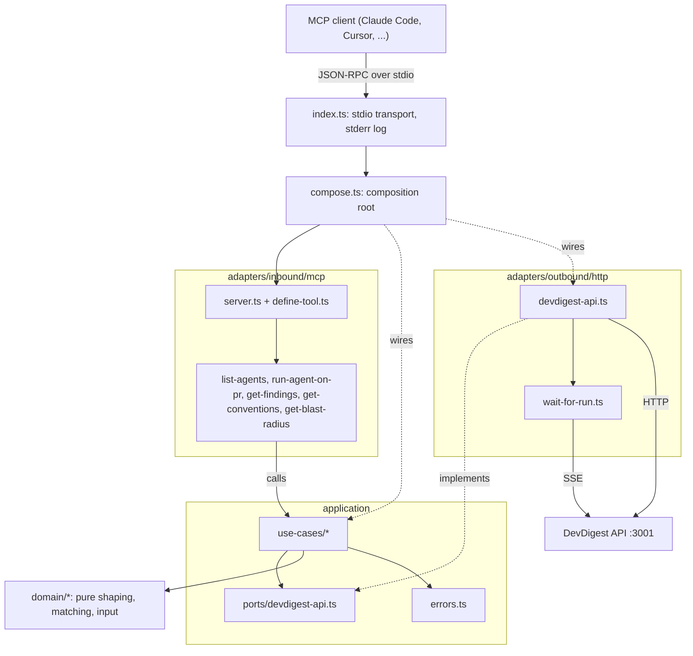
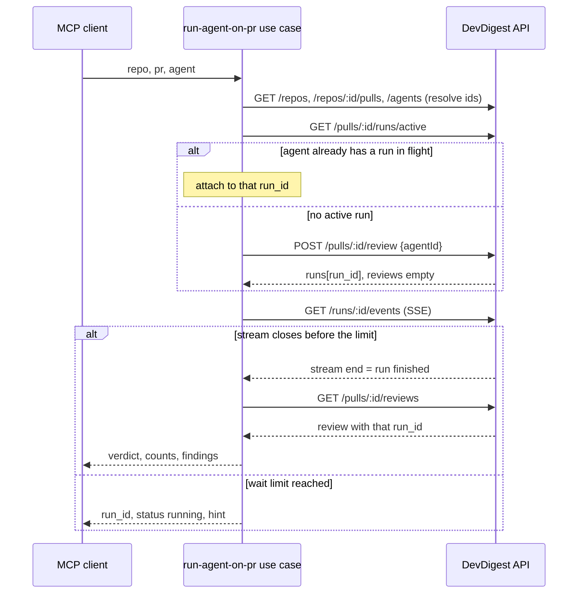

# MCP tools contract

> **Status:** partial · **Verified against:** `c9e51df` (working tree, `mcp/` untracked) on 2026-10-04 · **Sources:** plan `docs/plans/2026-10-04-devdigest-mcp.md`, code `mcp/src/**` (read, not executed: the first `npm test` run of steps 4-6 is pending; manual MCP-client verification (plan step 7) not done)

Shipped (in code): all five tools, error mapping, caps. Not shipped: real `get_blast_radius` (plan step 9; visible stub), CI workflow, per-client verification.

## Conventions shared by all tools

- Arguments are flat scalars: `repo` = `"owner/name"` (anchored regex, `domain/input.ts:REPO_PATTERN`), `pr` = positive safe integer, `agent` = agent name (trimmed, 1-200 chars; matched case-insensitively, `domain/match.ts`). Invalid arguments never reach a use case: result is `isError` with `Invalid arguments: <path> <message>; ... Fix the arguments and call again.` (`define-tool.ts`).
- Success = one text content item with compact JSON (`JSON.stringify`). Failure = `isError: true` with a one-line message (see "Errors").
- No `outputSchema`, no `title`. Server `instructions`: `DevDigest PR review. Start with list_agents.`
- Unknown tool name: `Unknown tool '<name>'. Available tools: <list>.` (`server.ts`).
- Annotations: `readOnlyHint: true` on `list_agents`, `get_findings`, `get_conventions`, `get_blast_radius`; none on `run_agent_on_pr`.
- Strings returned from the API are flattened (control chars -> space) and clipped (`domain/text.ts:clipText`).
- Only `run_agent_on_pr` can start a (paid) run; reads never call reviewer-core or an LLM.

## Tools

### `list_agents` — read-only
- Description: `List the review agents configured in DevDigest. Call first to get a valid agent name.`
- Input: none.
- Output: `{agents:[{name, description, enabled}], more?}`. name <= 100 chars, description <= 120 chars, at most 100 agents; `more` = agents cut (omitted when 0). `id`, `system_prompt` and every other field are dropped at the HTTP boundary.
- Calls: `GET /agents`.
- Errors: API errors only.

### `run_agent_on_pr` — write, may cost money
- Description: `Run one review agent on a pull request and wait for the result (up to 2 min). Returns verdict and findings. Starts a paid LLM run.`
- Input: `repo` (required), `pr` (required), `agent` (required).
- Output (finished): shaped review `{run_id, agent, verdict, score, counts:{critical,warning,suggestion}, findings:[{severity,file,line,title,why}], more}` (see "Review shape").
- Output (limit reached or stream ended while run still `running`): `{run_id, status:"running", hint:"Still running. Call get_findings for this PR in ~30s."}`; the run keeps going in the API process.
- Flow: resolve PR and agent -> `GET /pulls/:id/runs/active`; if this agent already has a run in flight, attach to it (no second run) -> else `POST /pulls/:id/review {agentId}` -> SSE `GET /runs/:id/events` until the stream closes or the limit passes -> `GET /pulls/:id/reviews` (row with that `run_id`, `kind === 'review'`) -> if absent, `GET /pulls/:id/runs` for `status`/`error`.
- Wait limit: `DEVDIGEST_MCP_WAIT_MS`, default 120000 (min 1000, max 600000). Client tool-call timeouts must be at least this long (per-client check pending, plan step 7).
- Errors: `Run <id> failed: <error>. Call run_agent_on_pr again or pick another agent.`; `Run <id> was cancelled. Call run_agent_on_pr again or pick another agent.`; `Run <id> finished but no review was saved. Call get_findings for this PR, or call run_agent_on_pr again.`; plus resolver and API errors.

### `get_findings` — read-only
- Description: `Read verdict and findings of reviews already run on a pull request. Does not start a review.`
- Input: `repo`, `pr` (required); `agent` (optional, name); `severity` (optional enum `CRITICAL|WARNING|SUGGESTION`, minimum level).
- Output: `{reviews:[<review shape>]}` — only `kind === 'review'` rows, newest per agent (identity: `agent_id`, else `agent_name`, else review id), ordered newest first; filtered to `agent` when given.
- Errors: `No reviews[ by agent '<name>'] on PR #<n> of <owner/name> yet. Call run_agent_on_pr to run one.`; plus resolver and API errors.

### `get_conventions` — read-only
- Description: `Get the house rules extracted from a repository (latest scan). Use before writing or reviewing code there.`
- Input: `repo` (required); `category` (optional enum `ConventionCategory`: `naming|structure|testing|error-handling|api-contract|other`).
- Output: `{scanned_at, conventions:[{category, rule, accepted, evidence:"path:line"}], more?}`. All candidates of the latest scan (accepted first, API order kept inside each group), at most 50, `rule` <= 300 chars, `evidence_path` <= 200 chars; snippets and ids dropped; `more` = rules cut.
- Errors: `No conventions scan for <owner/name> yet. Ask the user to run the Conventions extractor in DevDigest.` (emitted when the scan has zero candidates, before the category filter; a filter that matches nothing returns an empty list instead).

### `get_blast_radius` — read-only, stub
- Description: `Show which symbols, callers and endpoints a pull request affects. Not implemented yet.`
- Input: `repo`, `pr` (validated, then ignored).
- Output: always `isError: true`, text `get_blast_radius is not implemented yet. Do not retry; continue without it.`
- Status: Planned (plan step 9: new read-only server route + real handler; input schema stays).

## Review shape

`counts` always describes ALL findings of the review (even when `severity` filtered the list). `findings` = filtered, sorted by severity (CRITICAL, WARNING, SUGGESTION; input order inside a level), capped at 10; `more` = filtered findings that did not fit. `file` <= 300, `title` <= 200, `why` = `rationale` <= 300 chars, `agent` <= 60, `run_id` <= 64. `suggestion` text is omitted. `verdict` (`approve|comment|request_changes|null`), `score` (number|null) and `run_id` may be null as persisted. (`domain/review-shape.ts`)

## Errors

| Situation | Message | Source |
|---|---|---|
| Bad repo string | `Repo '<x>' is not valid. Use the form owner/name, for example acme/payments-api.` | `resolve.ts` |
| Repo not added | `Repo '<o/r>' is not added to DevDigest. Known repos: <up to 20, or none>. Ask the user to add it in the DevDigest UI.` | `resolve.ts` |
| Repo matches several | `Repo '<o/r>' matches <n> repos in DevDigest (ids ...). Ask the user to remove the duplicate in the DevDigest UI.` | `resolve.ts` |
| PR not imported | `PR #<n> is not imported for <o/r>. Ask the user to import pull requests in DevDigest.` | `resolve.ts` |
| PR duplicated | `PR #<n> appears <k> times for <o/r>. Ask the user to re-import pull requests in DevDigest.` | `resolve.ts` |
| Unknown agent | `Agent '<x>' not found. Call list_agents for valid names.` | `resolve.ts` |
| Ambiguous agent | `Agent name '<x>' is ambiguous: it matches <n> agents (<name> [<id8>], ...). Ask the user to give the agents distinct names in the DevDigest UI.` | `resolve.ts` |
| API down | `DevDigest API is not reachable at <url>. Ask the user to run ./scripts/dev.sh. Do not retry.` | `errors.ts` |
| Any HTTP 429 | `Review rate limit reached (10/min). Wait a minute before calling run_agent_on_pr again.` | `errors.ts` |
| Other API error (incl. timeout, contract drift) | `DevDigest API error <code>: <message>` (message clipped to 200 chars; codes `timeout`, `contract_mismatch` are synthetic) | `errors.ts` |
| Anything else | `devdigest-mcp hit an unexpected internal error (details are in the server log on stderr). Do not retry.` | `errors.ts` |

Per-request timeout of the HTTP adapter: 10 s (not applied to the SSE wait); response bodies over 10 MB are rejected as contract errors (`devdigest-api.ts`).

## Diagrams

Layers and allowed dependency directions (nodes are real files/folders in `mcp/src`):

`run_agent_on_pr` (blocking path; no polling):

Both diagrams: not rendered/validated (no `mmdc` available); syntax checked by hand against the `mermaid-diagram` skill (no `end` used as a label, special characters quoted).

## Planned (not implemented)

- Real `get_blast_radius` backed by a new read-only server route (plan step 9).
- Per-client verification, eval prompts and client configs (plan step 7; owned by other files, `mcp/README.md`, `.mcp.json`, `mcp/evals/tasks.md`).
- CI workflow `mcp.yml` (needs owner approval; `.github/workflows/` is Do Not Touch).
